# Stratex

**AI-powered trading bot builder for Bitget — describe a strategy in plain English, and an AI checks its own risk before anything goes live.**

Built for the Bitget AI Base Camp Hackathon S1 (Track 1: Trading Agent).

🔗 **Live app:** [stratex-agent-builder.vercel.app](https://stratex-agent-builder.vercel.app)
🔗 **Backend API:** [stratex-production.up.railway.app](https://stratex-production.up.railway.app)
🎥 **Demo video:** [Watch on X](https://x.com/i/status/2070037740989645172)

---

## Screenshots

| | |
|---|---|
|  Risk gate flagging a strategy mismatch — the AI is recommending the opposite direction of the user's original strategy, based on current market conditions | 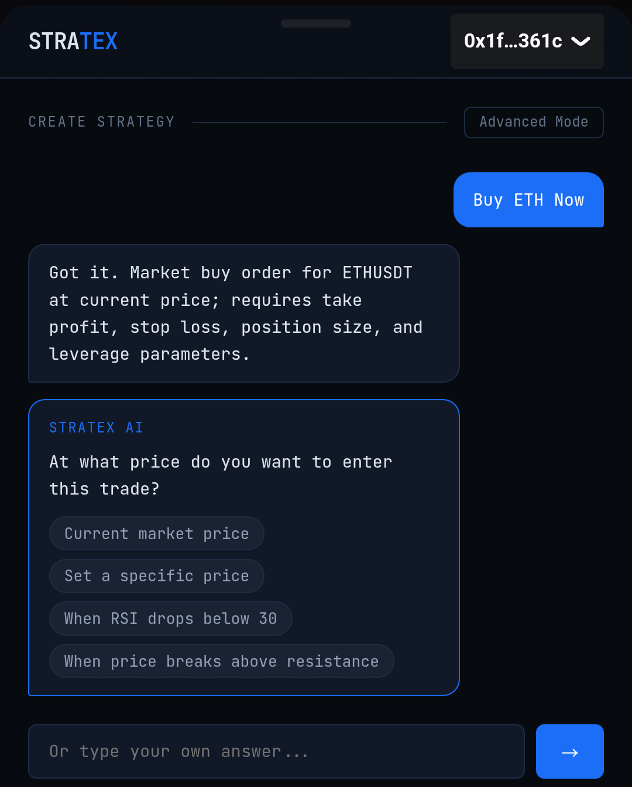 The clarifying chat: leverage is never assumed, and the warning text reflects the asset's real current volatility |
| 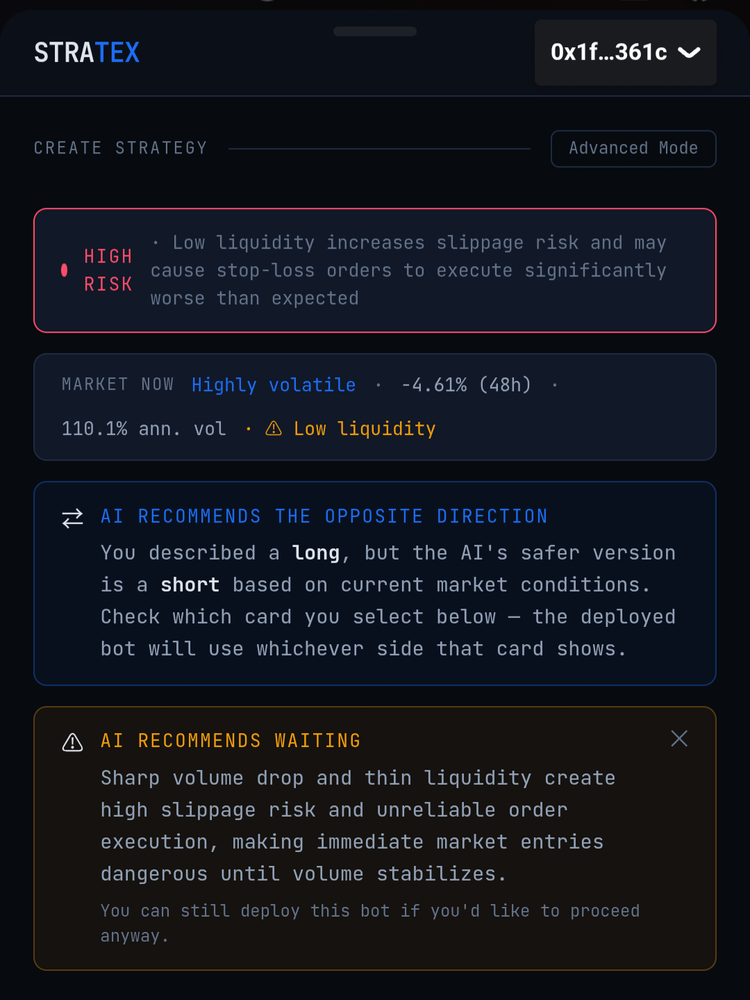 Side-by-side strategy comparison — your original strategy vs. the AI's safer, market-aware alternative | 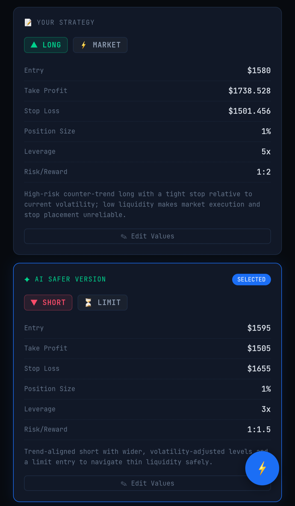 The AI's full reasoning for every change it made, plus an explicit "wait" recommendation when conditions are unfavorable |
| 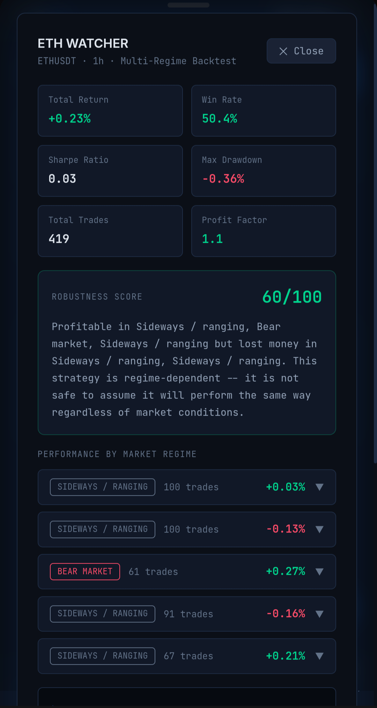 A real backtest result — explicitly regime-dependent, with a robustness score and per-regime breakdown | 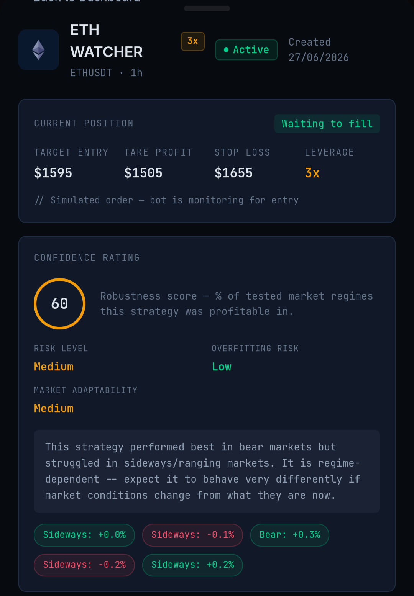 The same confidence rating, attached permanently to the bot after deployment |
| 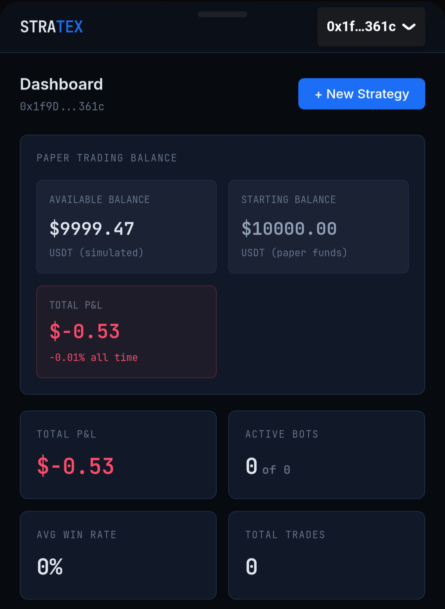 Dashboard view — live paper-trading balance and portfolio-wide stats | 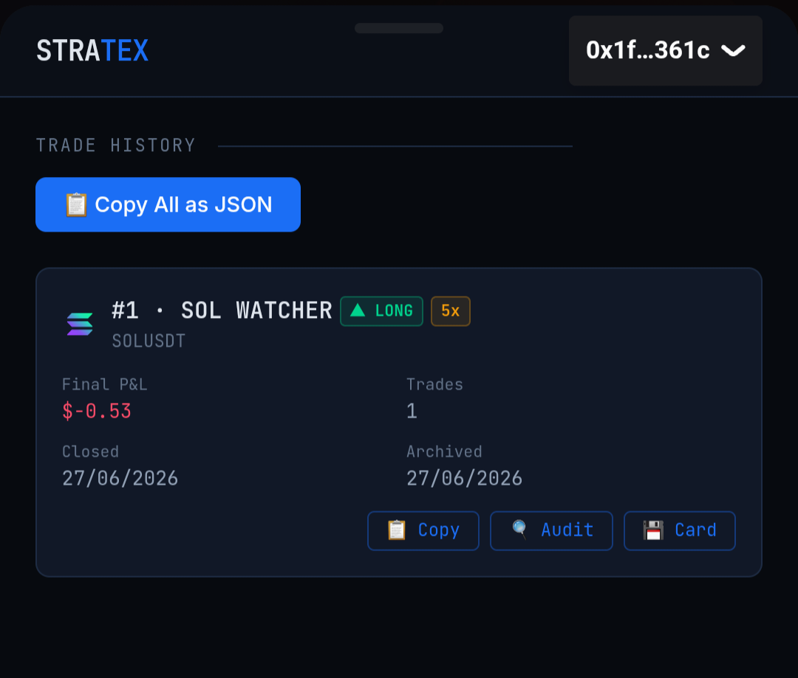 Trade history — every closed trade archived with one-click audit and shareable PnL card actions |
| 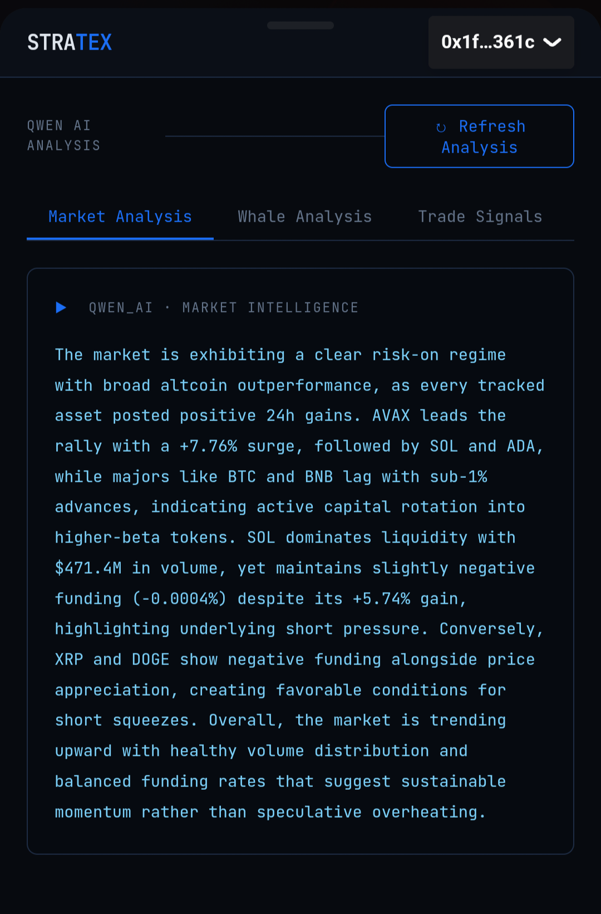 Qwen-generated market intelligence summarizing current conditions across tracked assets | 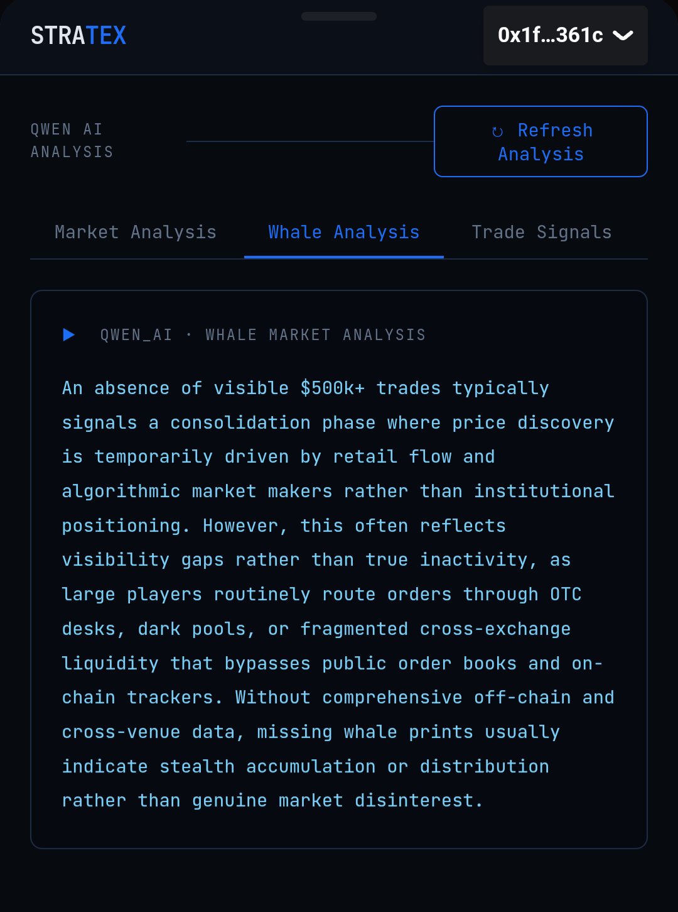 AI commentary on on-chain whale activity and what the absence of visible large trades likely indicates |
| 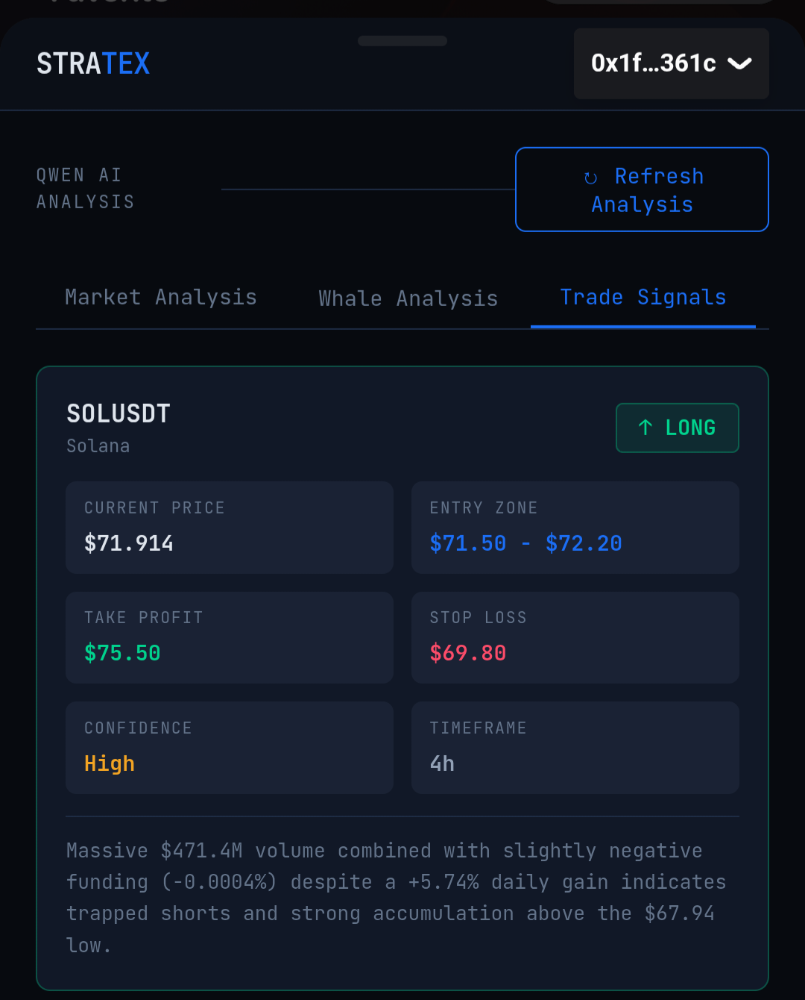 An AI-generated trade signal with entry zone, target, stop, and confidence level | 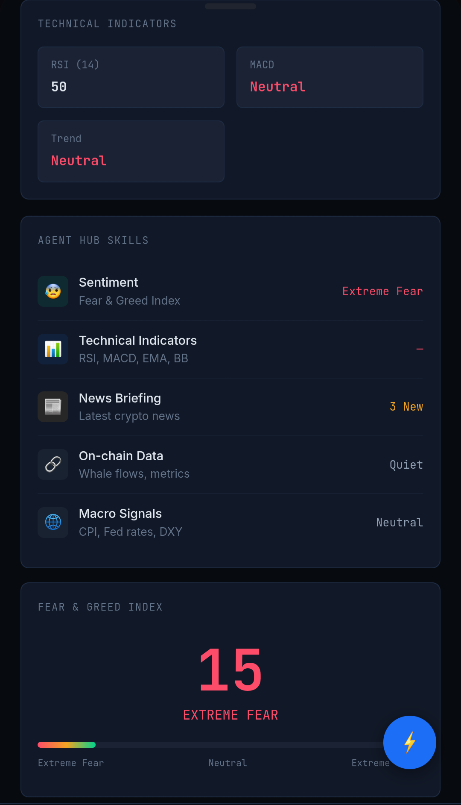 Live technical indicators (RSI, MACD, trend) alongside the current Fear & Greed Index |

---

Stratex turns a plain-English trading idea into a fully simulated, autonomous trading bot — without ever touching real funds.

Type something like *"Buy BTC at $60k with 10% of my portfolio, sell at $61k"*, and Stratex:

1. **Parses it with AI** (Qwen) into structured trade parameters
2. **Asks what's missing** — stop-loss, position size, leverage — through a quick-pick chat, not a form
3. **Analyses the risk** and proposes a safer alternative version, side-by-side with yours
4. **Lets you choose or edit either version** before anything is deployed
5. **Runs it live** against real Bitget prices, with the AI continuing to monitor the position and adjust stop-loss/take-profit if conditions change
6. **Lets you audit it later** — ask the AI to review any bot's decisions and flag mistakes, in plain English

Every trade is **100% simulated paper trading.** Each wallet starts with $10,000 in paper USDT and trades against real, live Bitget market prices — so every result is genuinely earned against the actual market, with zero real-fund risk.

---

## Vision & Thesis

Most AI-generated trading bots fail not because the AI can't parse a strategy, but because nothing checks whether that strategy is *trustworthy* before it goes live. Tools that "describe a trade in plain English" typically do exactly that and stop — they don't verify the strategy against real market conditions, don't test it against more than one kind of market regime, and don't carry real consequences for leverage beyond a bigger multiplier on the upside.

Stratex's thesis is that an AI-generated trading strategy should have to **prove itself** before it's allowed to run, the same way a human risk desk would push back on a trader's plan rather than just executing it on request. Concretely, this means:

- A strategy is checked against the *current* state of the market it's about to trade in — not just validated for internal consistency
- The "safer alternative" Stratex proposes is generated *with that live regime in mind*, not just a tighter version of the user's own numbers
- Every bot is backtested against real historical data across multiple independently-classified market regimes before deployment, and a strategy that only works in one regime is flagged explicitly rather than averaged into a single number that hides the weakness
- Leverage carries real, modeled consequences (liquidation), not just bigger numbers
- Nothing is a black box after deployment — every bot can be asked to explain and audit its own decisions, at any time

## Key Features

- **AI strategy parsing & clarifying chat** — plain English in, structured strategy out, with the AI asking about anything missing (entry, stop-loss, take-profit, position size, leverage) via quick-pick buttons or free text
- **Market-aware risk analysis** — every proposed "safer" strategy is generated using the pair's *live* market regime, not generic risk-reduction
- **Trade/no-trade veto** — Stratex can explicitly recommend against trading a pair right now if current conditions are structurally mismatched to the strategy
- **Volatility-aware leverage** — leverage is never silently assumed; the options offered narrow automatically when current volatility is high
- **Real liquidation modeling** — margin and exposure are tracked separately; leverage carries genuine downside risk, not just amplified upside
- **Real multi-regime backtesting** — every bot's exact configuration is replayed bar-by-bar against real historical Bitget data, split into regimes by actual computed statistics
- **Confidence rating system** — every bot gets a Robustness Score (0–100), Risk Level, Overfitting Risk, and Market Adaptability rating, computed from the real backtest
- **Live decision console** — every risk re-check, SL/TP adjustment, and audit flag streams into a floating, tabbed, wallet-scoped live log
- **On-demand AI auditing** — any bot, active or closed, can be reviewed by the AI for real mistakes; wallet-wide pattern detection looks across your *entire* trading history
- **Shareable PnL cards** — branded, downloadable snapshots of any live or closed position with real live pricing
- **Full trade history & export tooling** — every trade is archived permanently, and two standalone scripts export a complete trading log and a reproducible backtest report

### Core strategy flow
- **Natural-language strategy parsing** — Qwen extracts asset, entry, TP/SL, position size, and leverage from plain English
- **Multi-turn clarifying chat** — quick-pick buttons or free text fill in anything missing
- **Live price grounding** — no hallucinated prices; every parse is checked against Bitget's real current price
- **Asset-availability checking** — gracefully rejects assets not listed on Bitget instead of guessing
- **Risk analysis with a safer alternative** — the AI proposes a second, lower-risk version of your strategy side-by-side with your original, with an explicit risk/reward comparison and recommendation
- **Long and short positions**, both fully supported

### Leverage, with real risk
- Ask for leverage in plain English (*"5x leverage"*) and the AI walks you through it as part of the clarifying chat — it's never silently assumed
- **Real liquidation price calculation** (`entryPrice × (1 ± 1/leverage)`), enforced in the simulator
- Margin vs. exposure are tracked separately — leverage genuinely amplifies both gains and the risk of a full margin wipeout, not just a cosmetic multiplier

### Live risk monitoring
- Once a bot is running, the AI re-evaluates the position whenever price moves significantly (≥1.5% since the last check) and can adjust stop-loss or take-profit, logging its reasoning every time
- Liquidation checks take priority over take-profit/stop-loss on every tick
- A **live decision console** (floating, tabbed by type) streams every risk re-check, adjustment, and audit flag in real time, so you can watch the AI's reasoning as it happens

### AI auditing
- **Per-bot auditing** — ask the AI to review any bot, active or archived, against its own trade log and decision history, and flag real mistakes or risk-management weaknesses (or confirm it found none)
- **Wallet-wide pattern detection** — beyond single trades, ask the AI to review your entire trading history for recurring patterns: repeated losses on the same asset, ignored risk warnings, leverage habits, and more

### Real, multi-regime backtesting
- Every bot can be backtested against **real historical Bitget price data** — not randomized numbers
- Historical price action is automatically split into regimes (bull / bear / sideways / high-volatility) based on actual computed trend and volatility statistics, not hardcoded calendar dates
- The strategy's entry/TP/SL/liquidation logic is replayed bar-by-bar against each regime using the exact same leverage math as live trading
- A **robustness score** and verdict explicitly flag strategies that only work in one market condition, instead of hiding that weakness in an averaged number

### Everything else
- **Shareable PnL cards** — a clean, branded snapshot of any live or closed position, with live current price and exact P&L, downloadable as a PNG
- **Full trade history** — every closed position archives permanently with its complete trade log; copy any single entry or the entire history as JSON
- **Per-wallet paper balances** — $10,000 USDT starting balance per connected wallet, persisted to disk, with real dollar P&L and an automatic reset if a wallet's balance drops below $100
- **Mobile-responsive** throughout, with a bottom tab bar nav and card-based layouts on small screens

---

## How Stratex Handles Backtesting

Backtesting in Stratex is not a separate, simplified calculation — it's the exact same code path used live, just replayed against history instead of polled in real time:

1. **Historical data is fetched directly from Bitget's futures (mix) API** — real OHLCV candles for the requested asset and timeframe, not synthetic or randomized data.
2. **The historical window is split into segments**, and each segment is independently classified into a regime (bull / bear / sideways / high-volatility) based on its own computed trend and volatility statistics — never hardcoded calendar dates.
3. **The strategy's exact configuration is replayed bar-by-bar** against each regime: entry condition, stop-loss, take-profit, and liquidation checks all run in the same order and with the same leverage math (`services/leverage.js`) that the live simulator uses.
4. **Metrics are computed from the resulting trades** — total return, win rate, max drawdown, a Sharpe-style ratio, and profit factor — per regime and aggregated across all of them.
5. **A confidence rating is derived from the results**: Robustness Score (the % of tested regimes the strategy was profitable in), Risk Level, Overfitting Risk (does performance depend heavily on one specific regime?), and Market Adaptability — plus a plain-English explanation replacing a generic "backtest complete" message.

This same engine runs in three places: the standalone `/api/backtest/run` endpoint, automatically during bot creation (`/api/bots/create`) to produce the confidence rating, and in the standalone `export-backtest-report.js` script used for hackathon submission — so results are consistent and reproducible everywhere they appear.

## How It Handles Regimes

Regimes are never assumed or hardcoded — they're derived from the data itself, every time:

- A historical window is split into a fixed number of segments
- For each segment, Stratex computes the **net price change** (trend direction and magnitude) and the **annualized volatility** (standard deviation of bar-over-bar returns)
- A segment is labeled `high_volatility` if its volatility exceeds a threshold regardless of direction; otherwise it's labeled `bull`, `bear`, or `sideways` based on the net price move
- The same classification logic is also run against a short recent window (not historical) to assess **current** conditions for a pair — this is what powers the live market-conditions banner shown during strategy creation, the trade/no-trade veto, and the volatility-aware leverage question

Because the classification is purely statistical, it works identically for any asset Bitget lists — there's no per-asset tuning or assumption baked in about when a particular coin was "trending."

---

## Tech stack

**Frontend**
- React 19 + Vite 8
- [wagmi](https://wagmi.sh/) v2 + [RainbowKit](https://www.rainbowkit.com/) v2 — wallet connect (Ethereum mainnet, Polygon, Arbitrum, Base)
- React Router v7
- Recharts
- html2canvas — client-side PNG generation for shareable PnL cards
- Dark trading-terminal aesthetic, JetBrains Mono for data

**Backend**
- Node.js + Express (ESM)
- In-memory data structures, persisted to JSON files on disk (no external database)
- A 5-second polling loop fills orders, monitors stop-loss/take-profit/liquidation, and triggers AI risk re-evaluation on significant price moves

**AI**
- [Qwen](https://www.alibabacloud.com/en/product/modelstudio) (via Alibaba Cloud), `qwen3.6-plus` — powers strategy parsing, risk analysis, live position monitoring, and bot/wallet auditing

**Market data**
- [Bitget](https://www.bitget.com/) futures (USDT-margined perpetuals) public REST API under `/api/v2/mix/` — live prices, tickers, and historical candle data for backtesting. All endpoints require a `productType=USDT-FUTURES` parameter. Note: futures granularity values follow a different format than Bitget's spot API (e.g. `5m` rather than spot's `5min`) — verify exact accepted values against Bitget's current docs if extending timeframe support.
- [CoinGecko](https://www.coingecko.com/) API — dynamic coin icons

**Deployment**
- Frontend: [Vercel](https://vercel.com/)
- Backend: [Railway](https://railway.app/)

> **No real money or order execution exists anywhere in this project.** This is a fully simulated, paper-trading system. Bitget HMAC order-signing helpers exist in the codebase but are intentionally unused dead code.

---

## Environment Configuration Reference

### Backend (`backend/.env`)

| Variable | Required | Purpose |
|---|---|---|
| `PORT` | No (defaults to 5000) | Port the Express server listens on |
| `QWEN_API_KEY` | **Yes** | Alibaba Cloud API key — powers all AI features (parsing, risk analysis, monitoring, auditing) |
| `QWEN_BASE_URL` | **Yes** | Base URL for the Qwen chat completions endpoint |
| `COINGECKO_API_KEY` | **Yes** | Used for dynamic coin icon lookups |
| `BITGET_API_KEY` | No | Present for future use (see Roadmap); not currently required since Stratex only reads public Bitget market data |
| `BITGET_SECRET_KEY` | No | Same as above — HMAC signing helpers exist in the codebase but are unused dead code today |
| `BITGET_PASSPHRASE` | No | Same as above |
| `ALCHEMY_API_KEY` | No | Present but unused — real wallet balance display was intentionally replaced by the paper-trading balance |

### Frontend (`frontend/.env`)

| Variable | Required | Purpose |
|---|---|---|
| `VITE_API_URL` | **Yes** | Base URL the frontend uses for all backend API calls. Set to `http://localhost:5000` for local dev, or your deployed backend URL (e.g. Railway) in production. Vite bakes this in at build time — changing it requires a rebuild/redeploy, not just an env var update. |

---

## Running locally

### Prerequisites
- Node.js 18+
- npm
- A Qwen API key (Alibaba Cloud) — required for all AI features
- A CoinGecko API key (free tier is sufficient) — used for coin icons

> **Note on Bitget API access:** Bitget's public API is blocked by some ISPs in certain regions. If price/candle requests time out locally, a VPN may be required during development. This is not an issue on Vercel/Railway's servers in production.

### 1. Clone the repo
```bash
git clone https://github.com/OpeyemiMoses/STRATEX.git
cd STRATEX
```

### 2. Backend setup
```bash
cd backend
npm install
```

Create a `.env` file in `backend/`:
```env
PORT=5000
QWEN_API_KEY=your_qwen_api_key
QWEN_BASE_URL=your_qwen_base_url
COINGECKO_API_KEY=your_coingecko_api_key

# Present but unused — real order execution is intentionally not implemented
BITGET_API_KEY=
BITGET_SECRET_KEY=
BITGET_PASSPHRASE=
ALCHEMY_API_KEY=
```

Start the backend:
```bash
node index.js
```
The API will run on `http://localhost:5000`. You should see `Server running on port 5000` and `Simulation engine started — checking every 5s` in the console.

### 3. Frontend setup
In a new terminal:
```bash
cd frontend
npm install
```

Create a `.env` file in `frontend/`:
```env
VITE_API_URL=http://localhost:5000
```

Start the frontend:
```bash
npm run dev
```
The app will run on `http://localhost:5173` (Vite's default).

### 4. Connect a wallet and go
Open the app, connect a wallet via the RainbowKit modal, and you'll get a fresh $10,000 paper-trading balance automatically. Head to **Create Strategy** and describe a trade in plain English to get started.

---

## Backend REST Endpoints

All endpoints are relative to the backend base URL (`http://localhost:5000` locally, or the deployed Railway URL).

### Strategy & AI analysis (`/api/strategy`)
| Method & Path | Purpose |
|---|---|
| `POST /parse` | Parses a plain-English strategy into structured fields via Qwen; checks live price/asset availability |
| `POST /clarify` | Returns the next clarifying question for a missing field; the leverage question is volatility-aware |
| `POST /analyse` | Full market-aware risk analysis: fetches current market state, runs the structural fit/veto check, returns the user's strategy vs. an AI-proposed safer alternative, plus `shouldTradeNow` |
| `POST /analyze` | Legacy bot-verdict endpoint (KEEP RUNNING / PAUSE / STOP) used by the backtest modal |
| `POST /market-analysis` | Qwen commentary on current conditions for an asset |
| `POST /whale-analysis` | Qwen commentary on recent whale activity |

### Bots (`/api/bots`)
| Method & Path | Purpose |
|---|---|
| `GET /` | List bots, optionally filtered by `?wallet=` |
| `GET /:id` | Single bot lookup |
| `POST /create` | Creates a bot; hard-enforces stop-loss/take-profit/position-size server-side, runs the real confidence-rating backtest before returning |
| `PATCH /:id/status` | Toggle active/paused (blocked client-side while a position is open) |
| `DELETE /:id` | Delete a bot (blocked client-side while a position is open) |
| `POST /:id/close` | Manually close an open position at the current live price |
| `POST /:id/audit` | AI review of a single bot's trade/decision history (active or archived) |
| `GET /wallet/:address` | Paper wallet balance lookup |
| `POST /wallet/:address/audit` | AI review of cross-trade patterns across a wallet's entire history |
| `GET /history/:address` | Archived (closed) trade history for a wallet |

### Backtesting (`/api/backtest`)
| Method & Path | Purpose |
|---|---|
| `POST /run` | Real multi-regime backtest for an arbitrary strategy configuration — same engine used during bot creation |

### Decisions / live console (`/api/decisions`)
| Method & Path | Purpose |
|---|---|
| `GET /recent` | Recent decision-log entries, filterable by wallet/type — powers the floating live console |
| `GET /bot/:botId` | Full decision history for a single bot |

### Market data (`/api/signals`, `/api/coingecko`, `/api/whale`)
| Method & Path | Purpose |
|---|---|
| `GET /signals/ticker/:symbol` | Live price for an asset |
| `GET /signals/technicals/:symbol` | RSI, MACD signal, trend |
| `GET /signals/fear-greed` | Crypto Fear & Greed Index |
| `GET /coingecko/icon/:symbol` | Cached coin icon lookup |

---

## Project structure

```
stratex/
├── frontend/
│   └── src/
│       ├── pages/           # Landing, Dashboard, CreateStrategy, Bots, BotDetail,
│       │                       BacktestResults, TradeHistory, Signals, QwenAnalysis
│       ├── components/      # AssetIcon, DecisionConsole, PnLCard, Modal,
│       │                       BacktestModal, Navbar, charts, and more
│       └── hooks/            # useBots, useStrategy, useWallet, useMarkets
└── backend/
    ├── routes/               # strategy, bots, backtest, signals, coingecko,
    │                           decisions, whale, wallet
    ├── services/             # simulator, paperWallet, tradeHistory, decisionLog,
    │                           riskMonitor, botAuditor, walletAuditor, leverage,
    │                           marketRegime, backtestEngine
    └── data/                 # gitignored — bots.json, wallets.json,
                                trade-history.json, decision-log.json
```

---

## Submission artifacts: trading log & backtest report

Two standalone scripts generate the artifacts required for hackathon submission. Both read directly from `backend/data/` and write to folders at the repo root — no running server required, safe to run locally or in any environment with access to the data files.

### Trading log

Generates a complete, timestamped ledger of every trade fill (entry and exit legs) across all wallets — required for the "verifiable usage record" submission requirement.

```bash
cd backend
node scripts/export-trading-log.js
```

Outputs `trading-log/trading-log.csv` and `trading-log/trading-log.md` at the repo root, with one row per fill: timestamp, trading pair, direction, price, quantity, and account balance change.

### Backtest report

Re-runs every currently active bot's exact strategy configuration through Stratex's real backtest engine — the same code path used live during bot creation — against real historical Bitget data. Satisfies the requirement that a backtest report include the code used to generate it and be independently reproducible.

```bash
cd backend
node scripts/export-backtest-report.js
```

Outputs `backtest-report/backtest-report.md` and `backtest-report/backtest-report.csv` at the repo root, with a full regime-by-regime breakdown and confidence rating (robustness score, risk level, overfitting risk, market adaptability) per bot. Requires network access to Bitget's public API and may take a few seconds per bot to run.

---

## Future Roadmap

- **Playbook integration** — allow users to securely provide their own Bitget API keys so Stratex can read real account data (balances, positions, order history) directly, rather than only operating against the simulated paper wallet. This would let the same risk-analysis, confidence-rating, and auditing infrastructure built for paper trading apply to a user's real Bitget account in a read-only capacity, without Stratex ever placing real orders.
- Real order execution (currently fully simulated; the HMAC signing helpers already in the codebase are unused dead code reserved for this)
- Expanded robustness testing against low-liquidity-specific historical windows, not just the four regimes currently classified
- Forced early-close / position-size-reduction as an active risk-mitigation action by the live monitor, beyond its current SL/TP-adjustment-only behavior

---

## Hackathon Submission Details (Bitget AI Base Camp)

### Frameworks, Models, and APIs Used
- **Frontend:** React 19, Vite 8, wagmi v2 + RainbowKit v2, React Router v7, Recharts, html2canvas
- **Backend:** Node.js, Express
- **AI model:** Qwen (`qwen3.6-plus`) via Alibaba Cloud — used for strategy parsing, risk analysis, live position monitoring, and bot/wallet auditing
- **Market data:** Bitget futures (USDT-margined perpetuals) public REST API for live prices and historical candles; CoinGecko for coin icons
- **Deployment:** Vercel (frontend), Railway (backend)

### Development Challenges & Solutions
- **Backtesting credibility:** an early version of the backtest engine returned fully randomized numbers. This was replaced with a real engine that fetches actual historical Bitget data, classifies it into market regimes from genuinely computed trend/volatility statistics (never hardcoded dates), and replays each strategy's exact entry/stop-loss/take-profit/liquidation logic bar-by-bar using the same math the live simulator uses.
- **Granularity format mismatches:** Bitget's API has historically used different casing/format conventions for time-granularity parameters between its spot and futures (mix) endpoints. A capitalization mismatch silently broke every historical data fetch at one point, surfacing as a misleading "pair not listed" error rather than a clear API error — root-caused by testing the live endpoint directly rather than trusting the error message at face value.
- **Leverage risk modeling:** rather than treating leverage as a cosmetic multiplier, margin and exposure are tracked as distinct values, with a real liquidation price calculated and checked with priority over standard stop-loss/take-profit logic.
- **Avoiding fabricated legitimacy:** an early landing page included invented usage statistics. These were removed entirely in favor of being explicit that Stratex is 100% simulated paper trading against real live prices — judged credibility was prioritized over a more impressive-looking but fabricated number.

### Agent Trading Thoughts
Stratex's core trading-agent behavior is built around the idea that an AI's job isn't just to execute a request, but to evaluate whether the request should be executed at all, under current conditions. In practice this means the agent: (1) gathers real market context before proposing a strategy, rather than reasoning about a pair in the abstract, (2) is willing to explicitly recommend against trading when conditions are unfavorable, rather than always producing an actionable answer, (3) backs every confidence claim with a real, reproducible backtest rather than a qualitative judgment, and (4) remains continuously accountable after deployment — logging every adjustment decision and submitting to its own audit on request, rather than operating as a black box once a bot is live.

---

## License

MIT